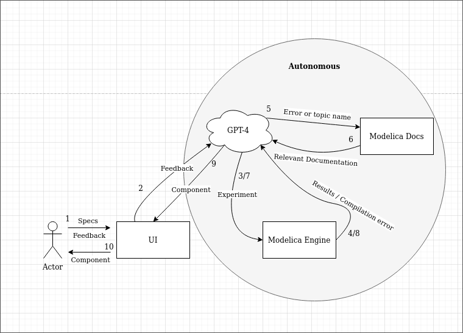

# LLModelica

## Running the project
1. Clone the repo
2. Add a file `LLModel/.env` containing `OPENAI_API_KEY = '<API_KEY>'`
3. Grab the Modelica Standard Library source so it can be embedded (`cd LLModel && mkdir data && cd data && git clone git@github.com:modelica/ModelicaStandardLibrary.git`)
4. Build the container (`docker build -t om-python .`)
5. Run the container (`./run`)
6. Run the LLM chain within the container (`./run-llm <PROMPT>`)

Upon first execution, a HuggingFace transformer will be downloaded and used to embed the Modelica Standard Library. The resulting embedding vectors will be persisted in a Chroma vector database at `data/om_embeddings`. This step took ~1 hour on my machine; YMMV.
